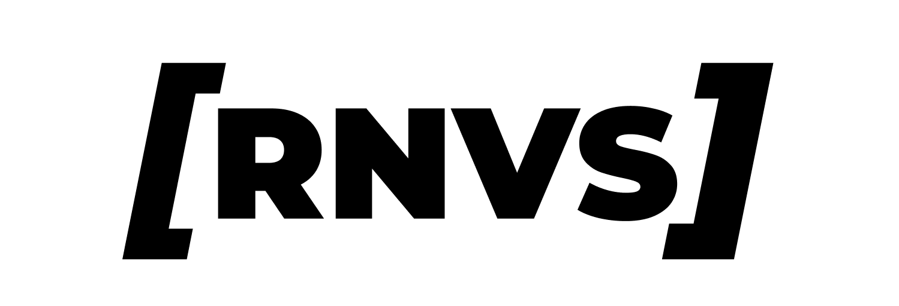

# react-native-version-setter



The simplest way to update your app version.

Will auto update:
```
android/app/build.gradle versionName
android/app/build.gradle versionCode
ios/{projectName}.xcodeproj/project.pbxproj MARKETING_VERSION
package.json "version"
```

## Install
Install in your project:
```npm i react-native-version-setter```
## Usage
```
$: npm run setVersion 1.2.0
[RNVS] MyApp: 1.0.0: ==> 1.2.0 ✅ 

$: npm run setVersion 1.2.0
[RNVS] Version is already 1.2.0 🛑
```

## Freeform Versioning
RNVS does not impose restrictions on versioning style. 
Feel free set your version numbers in whatever format works for you. For example, Date-based versioning:
```
$: npm run setVersion 1.20200909.1
[RNVS] MyApp: 1.0.0: ==> 1.20200909.1 ✅ 
```
In most cases it makes sense to use conventional [semantic versioning.](https://en.wikipedia.org/wiki/Software_versioning)

### Dashes are not valid
Due to iOS not supporting dashes in versions, it's not possible to set a version like `0.1.0-rc0`.

## Options
`-d`: Run with debug logging.

## Android versionName


## Note 
- Compatible with iOS projects using Xcode 11+
